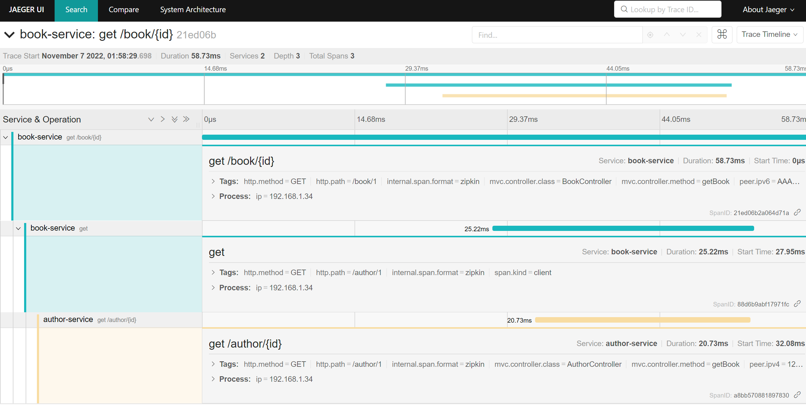

## Tracing Concept

https://ryanharrison.co.uk/2021/08/06/distributed-tracing-spring-boot-jaeger.html

This project is based on:

  1. Spring Sleuth
  2. Sleuth Brave 
  3. OpenTracing
  4. Zipkin Collector
  5. Jaeger UI

## Testing

Simply try to call a Book API and it inturn calls to read Author data. As a result we get this in tracing. 

> http://localhost:8082/book/1

> http://localhost:8081/library/1

## Pending Works

OpenTelemetry Project
Custom Tracing Params - Context
